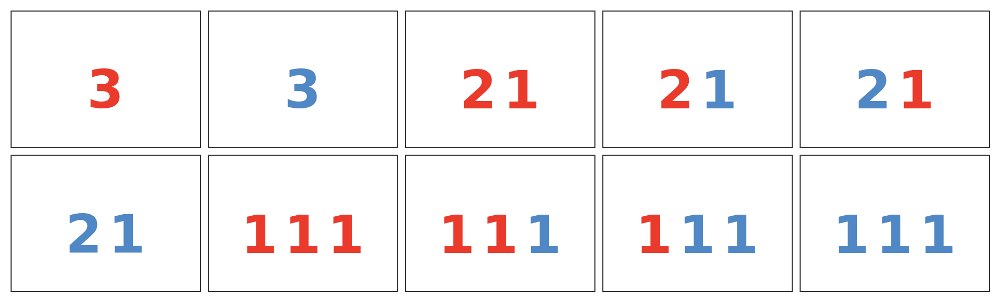

# 5 задание | 100 баллов

## Ограничения

+ Ограничение времени: 3 секунды
+ Ограничение памяти: 512 МБ

## Вопрос

Мальчик Виктор выписывает натуральные числа на листочек, для этого у него есть ручки k различных цветов.
Но он хочет, чтобы сумма выписанных чисел была в точности равна n.

Ему стало интересно, а сколько различных вариантов у него выписать числа таким образом.
Однако понятие различности у него довольно странное.
Так он считает два варианта различными, если можно найти такое значение и цвет, что это значение написано разное количество раз этим цветом.

Так, например, при n=3, k=2 есть следующие 10 вариантов:

| 1   | 2     | 3     | 4     | 5    |
|-----|-------|-------|-------|------|
| `3` | 3     | `21`  | `2`1  | 2`1` |
| 21  | `111` | `11`1 | `1`11 | 111  |



Помогите ему и скажите, сколько таких различных способов выписать
числа у него есть. Но так как ответ может быть достаточно большим,
выведите его по модулю 10 ^ 9 + 7.

## Входные данные

В единственной строке записаны два числа n, k (1 <= n, k <= 100) — необходимая сумма чисел и сколько цветов ручек у него есть.

## Выходные данные

В единственной строке выведите ровно одно число — количество вариантов по модулю 10 ^ 9 + 7.

## Примеры данных

### Пример 1

Вход:

```
3 2
```

Выход:

```
10
```

### Пример 2

Вход:

```
4 3
```

Выход:

```
51
```
