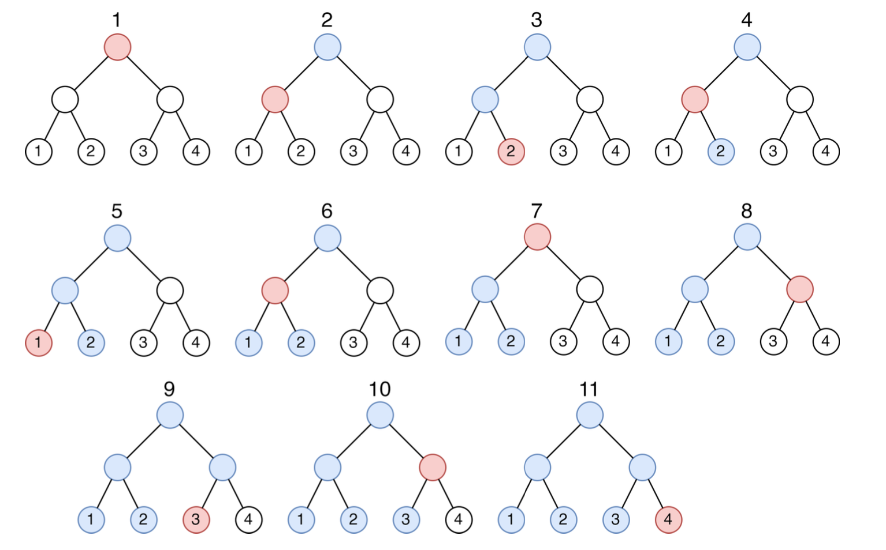

# 4 задание (100 баллов)

## Ограничения

+ Ограничение времени: 1 секунда
+ Ограничение памяти: 256 МБ

## Вопрос

За время работы микросервиса накапливается очень много файлов с логами.
Для удобного хранения все логи разбиваются на блоки по 2^d файлов в каждом.
Внутри блока файлы логов хранятся в иерархической структуре: все файлы блока разбиваются на пары, каждая пара помещается в отдельную директорию (в первой директории будут файлы с номерами 1 и 2, во второй - 3 и 4), получившиеся директории разбиваются на пары и по парам помещаются в другие директории.
Этот процесс повторяется до тех пор, пока все файлы не окажутся в одной общей директории, далее будем называть такую директорию корневой.

Можно заметить, что файлы хранятся в листах полного двоичного дерева.
В таком дереве у каждой директории есть два элемента (файла или директории) внутри, будем называть элемент внутри директории с меньшим номером левым, а другой - правым.

Для поиска нужного файла внутри одного блока из корневой директории запускается специальный алгоритм, который перемещается между файлами и директориями до тех пор, пока не найдет искомый файл.
Алгоритм начинает свое движение из корневой директории.
Находясь в директории, он спускается к одному из ранее не посещенных элементов.
Если таких элементов нет, он переходит к родительской директории.

Порядок выбора элемента, к которому необходимо спуститься из директории, определяется глобальным (общим для всех директорий) чередованием: сначала алгоритм переходит к левому элементу, при следующем выборе к правому, затем снова к левому, и так далее.
При этом если по порядку необходимо спускаться к элементу второй раз, то этот выбор пропускается.

Разработчик хочет найти файл с порядковым номером k, для этого он запустил алгоритм в блоке с этим файлом.
Найдите количество файлов и директорий, которые посетит алгоритм в процессе поиска файла k.

## Формат входных данных

В первой строке входных данных дано два числа d и k — характеристика дерева логов и номер файла, который необходимо найти с помощью алгоритма (1 <= d <= 60; 1 <= k <= 2^d).

## Формат выходных данных

Выведите количество файлов и директорий, которые посетит алгоритм в процессе поиска файла k `с учетом` файлa k.

## Замечание

Ниже дана иллюстрация ко второму примеру входных данных.
Красным цветом обозначается текущая вершина, а синим цветом помечаются вершины, которые мы посетили ранее.



## Примеры данных

### Пример 1

Вход:

```
1 1
```

Выход:

```
2
```

### Пример 2

Вход:

```
2 4
```

Выход:

```
7
```

### Пример 3

Вход:

```
3 7
```

Выход:

```
14
```
