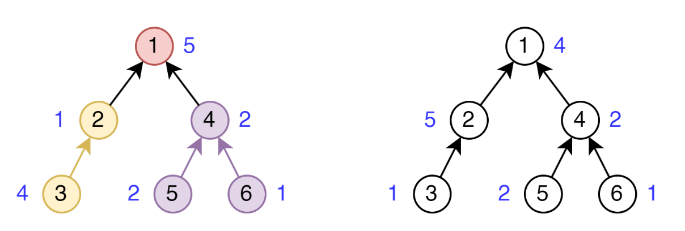

# 5 задание (100 баллов)

## Ограничения

+ Ограничение времени: 2 секунды
+ Ограничение памяти: 512 МБ

## Вопрос

На работе разработчики разделяют часть проекта на задачи.
Задачи внутри проекта могут зависеть от других задач.
При этом циклических зависимостей нет, и для всех задач кроме одной верно, что от них зависит только одна задача.
Задача, от которой не зависит никакая другая задача — готовый проект.
Кроме того, у каждой задачи есть целая, возможно отрицательная, характеристика h_i — количество удовольствия, которое принесёт эта задача разработчику, который будет ее выполнять.

Катя — лидер команды из трёх человек, которой поручено выполнить очередной проект.
Чтобы разграничить зоны ответственности было решено разделить проект на 3 части так, чтобы минимизировать количество зависимостей между задачами разных разработчиков.
Для этого необходимо, чтобы существовало ровно `две` задачи таких, что разработчик занимающийся этой задачей не совпадал с разработчиком, который занимается задачей, зависящей от этой задачи.
Также Катя хочет, чтобы суммарное удовольствие, полученное от выполнения задачи каждым из разработчиков было одинаковым.

Помогите команде и скажите, можно ли разделить все задачи проекта так, чтобы выполнялись все требования.

## Формат входных данных

В первой строке входных данных дано число n — количество задач в проекте (1 <= b <= 5 * 10^5).

Во второй строке дано n чисел — число p_i задает номер задачи, от которой зависит задача Ii, или 0, если задача с номером i является готовым проектом (0 <= p_i <= n).
Гарантируется, что существует единственный i, у которого p_i = 0.

В третьей строке дано n чисел — число с номером i задает количество удовольствия, которое будет получено при выполнении задачи (-100 <= h_i <= 100).

## Формат выходных данных

В единственной строке выведите «YES», если все задачи проекта можно разделить на 3 части так, чтобы выполнялись все требования, и «NO» иначе.

## Замечание

Ниже приведен пример распределения задач с зависимостями из первого и второго примеров из условий. Синим цветом рядом с каждой задачей обозначена величина . Стрелка от задаче a к задаче b означате, что задача a зависит от задачи b.



## Примеры данных

### Пример 1

Вход:

```
6
0 1 2 1 4 4
5 1 4 2 2 1
```

Выход:

```
YES
```

### Пример 2

Вход:

```
6
0 1 2 1 4 4
4 5 1 2 2 1
```

Выход:

```
NO
```
